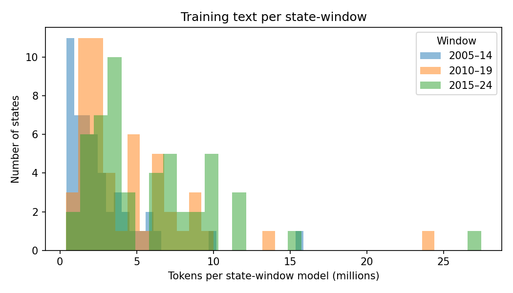
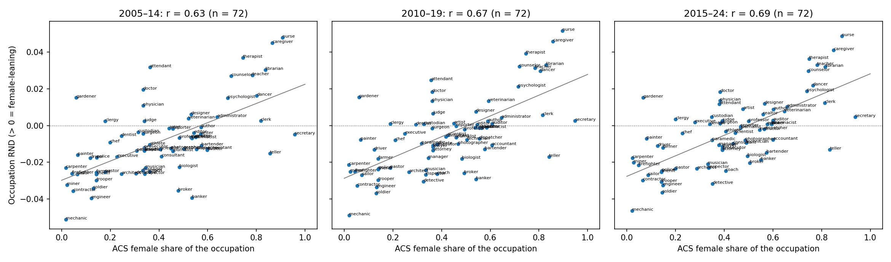
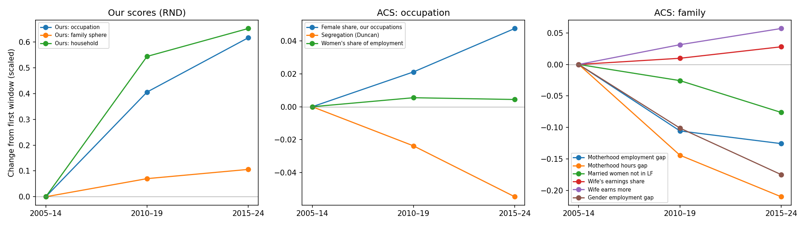
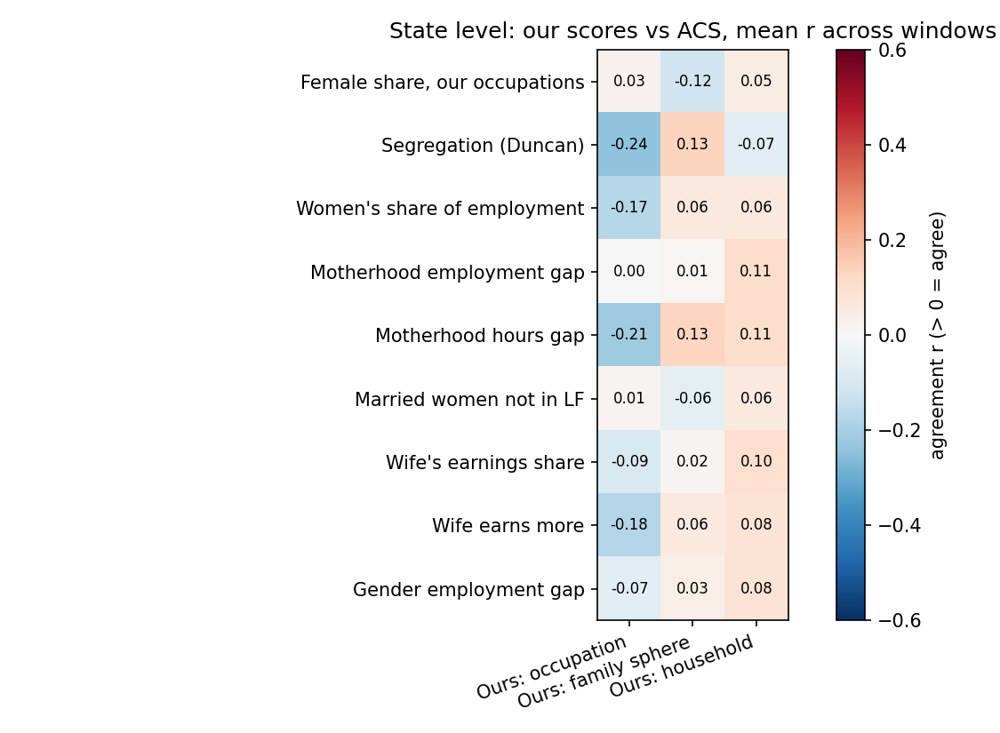
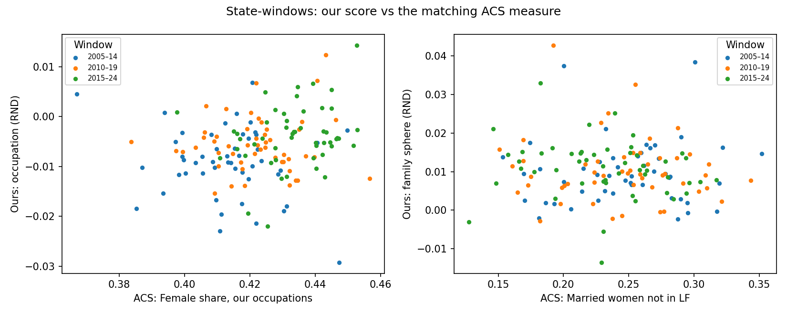
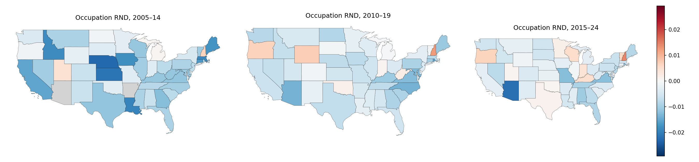
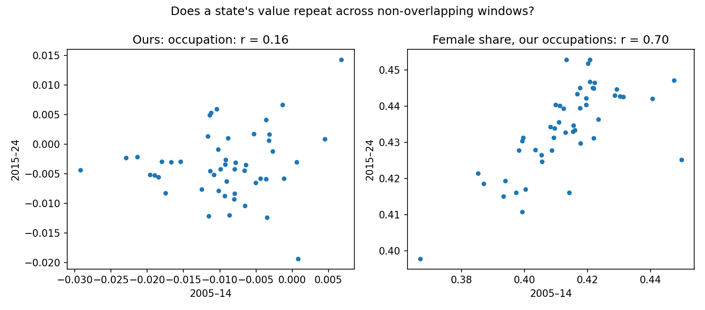
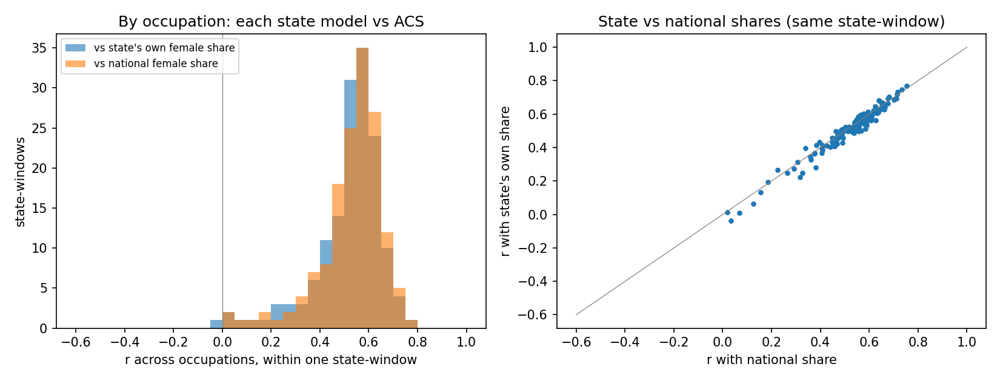
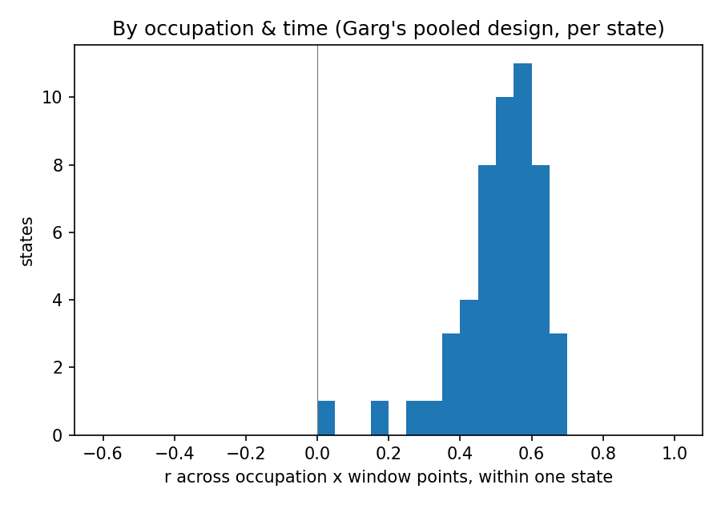
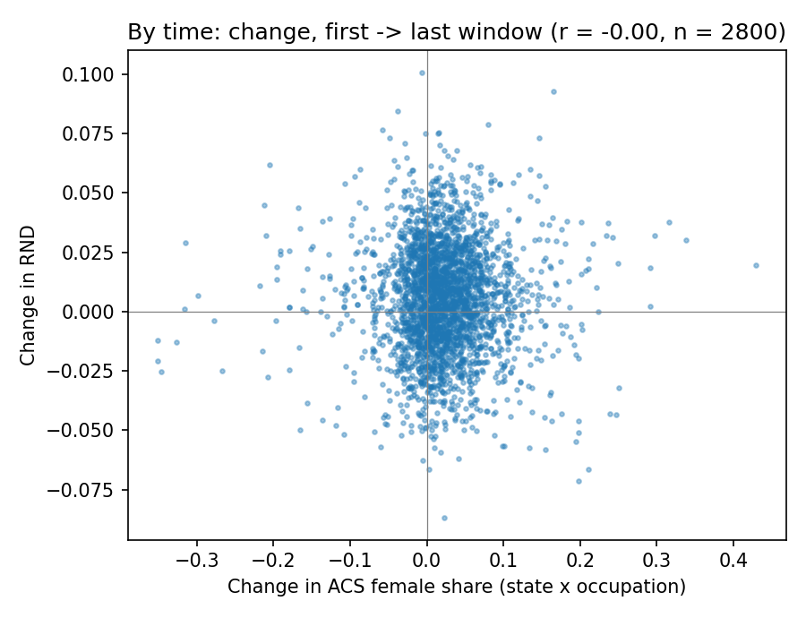

# Gender norms in US local news (3DLNews2): occupation and family

Notes for discussion with mentors, 2026-10-05. Figures and full tables:
`docs/us_3dlnews_report/` (regenerate with `scripts/report_us_dlnews.py`).
Decision history: `docs/research-log-wordlists.md`.

**In one paragraph.** We trained word embeddings on US local newspaper text for
each state and each 10-year window (2005–14, 2010–19, 2015–24), and measured
how close occupation and family words sit to female vs male words (RND, Garg et
al. 2018). Aggregated nationally, the measure tracks the census closely: across
72 occupations it correlates r = 0.63–0.70 with the ACS share of women in each
occupation, and over time it moves the same way as ACS (occupations become
less male-associated as women's share rises and segregation falls). Inside
each state, the model also ranks occupations like the workforce does (median
r ≈ 0.55), but no better against the state's own shares than against national
ones. Across states, the measure does not line up with ACS (|r| ≤ 0.24, unstable signs),
and a state's value in 2005–14 barely predicts its value in 2015–24 (r = 0.16),
whereas ACS state values repeat almost exactly (r = 0.70–0.98). With the
amount of text available per state, the embeddings capture national change
over time but not reliable differences between states.

---

## 1. Data

**Text: 3DLNews2** (Ariyarathne & Nwala), US local news articles collected from
Google search results for ~9,400 local newspapers, 1996–2024, with the
publishing outlet's state. We use Google-platform **newspaper** articles only
(TV and Twitter subsets downloaded but not used; TV is too thin per state).

| Window | States | States trained (≥ 500 articles) | Articles, median per state | Articles, total | Tokens per state, median (min – max) |
|---|---:|---:|---:|---:|---|
| 2005–14 | 51 | 49 | 4,259 | 342,228 | 1.8M (0.4M – 15.9M) |
| 2010–19 | 51 | 51 | 7,841 | 588,326 | 3.1M (0.4M – 24.4M) |
| 2015–24 | 51 | 51 | 11,559 | 780,648 | 4.1M (0.4M – 27.5M) |

Windows overlap, so an article counts in every window that contains its year.
For scale: a single year of Google Books / Ngram is billions of tokens.

**Survey data: American Community Survey (ACS)**, IPUMS USA 1-year samples
2005–2024, employed persons (occupation side) and adults 25–54 (family side).
All numbers use person weights (PERWT) summed over the window's years, so they
are representative of each state and window.

## 2. Method

- **Embeddings.** One word2vec model (skip-gram, 300 dimensions, window 5,
  min_count 20, 10 epochs) per state × window. Preprocessing: lowercase, NLTK
  tokenizer and English stopwords, near-duplicate wire stories removed within
  each window across states.
- **Time windows.** 10 years, moving in 5-year steps (2005–14, 2010–19,
  2015–24), the same design as our Google Ngram slices. Each window is labelled
  by its start year.
- **Measure: RND** (relative norm distance; Garg et al. 2018). For a word w,
  RND = ‖w − male centre‖ − ‖w − female centre‖ on unit-normalized vectors;
  **> 0 means w sits closer to the female words**. Gender anchors: Garg's 20
  male + 20 female words (he, man, father, son, ... / she, woman, mother,
  daughter, ...). Note: NLTK's stopword list removes the 8 pronouns, so the
  centres are built from the 32 noun anchors.
- **One score per category, state and window.** Words appear in vocabulary
  unevenly across small state models, so we use every list word present in at
  least half of the state-window models and estimate each unit's level with
  word fixed effects (RND = unit effect + word effect); with complete data this
  equals the plain average. Singular and plural forms are pooled
  (`nurse|nurses`).
- **"National".** There is no separately trained national model. National
  numbers aggregate the state models: an occupation's national score is its
  mean RND across state models in the window; the national trend is the mean
  over the 49 states present in every window.

## 3. Word lists

**Occupation (main focus).** Built from Garg et al.'s occupation list and their
census file, adapted to modern local news. Every candidate is documented in
`wordlists/en/occupation_family/occupation_grounding.csv`:

- all of Garg's words are accounted for: kept, replaced by the word news
  actually uses (fireperson → firefighter, newsperson → journalist, bankteller
  → teller), or excluded with a reason — obsolete (bootblack, typesetter),
  common surnames (smith, mason, porter, baker, cook, weaver), ambiguous
  (pilot, guard, conductor), gendered pairs (actor, waiter), not occupations
  (student, retired, sales);
- common modern occupations added (programmer, paramedic, receptionist,
  paralegal, nanny, caregiver, realtor, reporter, prosecutor, ...);
- each word is mapped to 2018 Census / IPUMS OCC2010 occupation codes
  (`occupation_occ2010.csv`: 70 one-to-one, 35 broader code, 24 several
  codes, 4 none) so it can be matched to ACS.

133 candidates; **75 used** (present in ≥ 50% of models): artist, attorney,
author, coach, doctor, driver, editor, executive, judge, lawyer, manager,
police, professor, prosecutor, reporter, secretary, teacher, writer,
administrator, sheriff, clerk, engineer, nurse, soldier, athlete, contractor,
detective, farmer, firefighter, journalist, pastor, photographer, instructor,
musician, supervisor, operator, chef, consultant, physician, scientist,
counselor, technician, trooper, dancer, designer, architect, carpenter,
entrepreneur, therapist, inspector, surgeon, mechanic, painter, veterinarian,
paramedic, biologist, dispatcher, librarian, broker, sailor, dentist,
accountant, miner, psychologist, caregiver, realtor, banker, attendant,
auditor, gardener, bartender, pharmacist, clergy, custodian, teller.

**Family.** Two lists:

- *Family sphere* (10, all used): home, parents, children, family, cousins,
  marriage, wedding, relatives, household, kitchen — Caliskan et al. (2017)
  WEAT family words plus household, kitchen; gender-neutral and frequent.
- *Household work* (20 candidates from American Time Use Survey activity
  categories; **9 used**): cleaning, cooking, groceries, dishes, gardening,
  laundry, parenting, daycare, chores. Words like housework, babysitting,
  caregiving are too rare in local news.

## 4. Comparison data (ACS, objective)

Per state and window, from IPUMS ACS microdata:

| Side | Measure | Higher means |
|---|---|---|
| Occupation | Female share of *our* occupations (each word mapped to its census codes; equal weight per occupation) | less traditional |
| | Occupational segregation, Duncan index over all occupations | more traditional |
| | Women's share of employment | less traditional |
| Family | Motherhood employment gap (childless women − mothers of children < 5) | more traditional |
| | Motherhood hours gap (usual weekly hours, same groups, employed) | more traditional |
| | Married women not in the labor force | more traditional |
| | Wife's share of couple wage income; share of couples where she earns more | less traditional |
| | Gender employment gap (men − women) | more traditional |

Subjective measures (attitudes) are not included here.

## 5. Results

### 5.1 National, by occupation (Garg-style)

Each occupation's national RND against the ACS share of women working in it.

| Window | Occupations | Pearson r | Spearman r |
|---|---:|---:|---:|
| 2005–14 | 72 | 0.63 | 0.61 |
| 2010–19 | 72 | 0.67 | 0.62 |
| 2015–24 | 72 | 0.70 | 0.64 |

Female end: nurse, caregiver, therapist, teacher, librarian, counselor.
Male end: mechanic, engineer, soldier, miner, firefighter, carpenter.
Outliers: *secretary* (~95% female, RND ≈ 0) — in news it is mostly the
political office; *doctor / physician* sit above their female share.

### 5.2 National trend

Means over the 49 states present in every window.

| Window | Ours: occupation (RND) | Ours: family sphere (RND) | Female share, our occupations | Segregation (Duncan) | Motherhood employment gap | Wife's earnings share |
|---|---:|---:|---:|---:|---:|---:|
| 2005–14 | −0.0092 | 0.0098 | 41.3% | 0.522 | 12.4 pp | 36.2% |
| 2010–19 | −0.0055 | 0.0106 | 42.2% | 0.509 | 11.1 pp | 36.5% |
| 2015–24 | −0.0035 | 0.0110 | 43.4% | 0.493 | 10.8 pp | 37.2% |

Occupations stay male-leaning in news text but become steadily less so, in
step with ACS: a rising female share in these occupations and falling
segregation. Family words stay female-leaning with little change; ACS family
measures move toward less traditional (smaller motherhood gaps, higher wife's
earnings share).

### 5.3 State level

Correlation across states between our score and each ACS measure, oriented so
that **> 0 = both point to more (or both to less) traditional norms**. Mean
over the three windows; full table in `tables/state_agreement.csv`.

| ACS measure | Ours: occupation | Ours: family sphere | Ours: household |
|---|---:|---:|---:|
| Female share, our occupations | 0.03 | −0.12 | 0.05 |
| Segregation (Duncan) | −0.24 | 0.13 | −0.07 |
| Women's share of employment | −0.17 | 0.06 | 0.06 |
| Motherhood employment gap | 0.00 | 0.01 | 0.11 |
| Motherhood hours gap | −0.21 | 0.13 | 0.11 |
| Married women not in LF | 0.01 | −0.06 | 0.06 |
| Wife's earnings share | −0.09 | 0.02 | 0.10 |
| Wife earns more | −0.18 | 0.06 | 0.08 |
| Gender employment gap | −0.07 | 0.03 | 0.08 |

### 5.4 Reliability: does a state's value repeat?

Correlation of state values between the two windows with no shared years
(2005–14 vs 2015–24).

| Measure | r |
|---|---:|
| Ours: occupation | 0.16 |
| Ours: family sphere | 0.21 |
| Ours: household | −0.17 |
| ACS: female share, our occupations | 0.70 |
| ACS: segregation (Duncan) | 0.98 |
| ACS: women's share of employment | 0.93 |
| ACS: family measures | 0.86 – 0.96 |

### 5.5 State level, Garg-style: by occupation, by time, and both

Same comparisons as 5.1 and 5.2, but inside each state: cells are state ×
occupation × window, pairing the occupation's RND in that state's model with
its ACS female share in that state and window (9,466 cells;
`scripts/check_state_occupations.py`).

**By occupation (within each state-window).** Correlation across a state's
~60–70 occupations.

| Window | State-windows | Median occupations | Median r, vs state's own share | Median r, vs national share | Share of state-windows with r > 0 |
|---|---:|---:|---:|---:|---:|
| 2005–14 | 49 | 60 | 0.52 | 0.54 | 98% |
| 2010–19 | 51 | 67 | 0.55 | 0.56 | 100% |
| 2015–24 | 51 | 69 | 0.56 | 0.58 | 100% |

**By occupation & time (Garg's pooled design, one state at a time).**
Correlation across a state's occupation × window points (~196 per state):
median r = 0.53 (interquartile range 0.47–0.60), positive in all 51 states.

**By time (within states).** Change from 2005–14 to 2015–24, ΔRND vs Δ female
share: r = −0.00 over 2,800 state × occupation pairs; r = −0.08 for the
states' average change (n = 49).

Restricting to larger ACS cells (weighted_n ≥ 2,000) changes nothing
(`tables/state_occ_*_large.csv`).

**Reading.** Every state's model, small as it is, ranks occupations by gender
much like the workforce does (r ≈ 0.55). But it matches the *national*
ranking just as well as its own state's, so the state models reproduce the
common US occupational gender typing rather than anything specific to the
state; and changes within a state over time do not follow that state's ACS
changes.

## 6. Interpretation

1. **The measure works where text is plentiful.** Pooling across states, the
   embedding gender scores of occupations line up with the census (r ≈ 0.65,
   the same kind of evidence Garg et al. show), and their change over time
   follows ACS in direction every window.
2. **Each state model gets the occupation ranking right, but nothing
   state-specific.** Within every state-window, occupation RND correlates
   r ≈ 0.55 with ACS female shares (5.5) — yet equally with the national
   shares, and within-state changes over time show no relation to ACS changes.
3. **It does not yet work across states.** Our state values barely repeat
   between non-overlapping windows (r = 0.16–0.21), while the ACS state values
   repeat almost perfectly. A measure that does not reproduce itself cannot
   correlate strongly with anything: with reliability ~0.15 for ours and ~0.85
   for ACS, even a perfectly valid measure could show at most r ≈ 0.36. The
   observed |r| ≤ 0.24 therefore cannot distinguish "valid but noisy" from
   "not valid".
4. **The likely cause is the amount of text.** A typical state-window model
   trains on 2–4 million tokens; embedding bias measures are known to be
   unstable at that size. The national results average over ~49 states, which
   cancels most of that noise.
5. **What else we tried** (details in the research log): 5-year windows
   (same picture: national r = 0.70–0.78, state reliability ≈ 0.1–0.5 within
   sampling error); one shared model per window with state-tagged gender words
   (worse: state values essentially random and the national trend vanished).

## 7. Options to discuss

- **Regions instead of states** (9 census divisions): 6–12× more text per
  unit; same pipeline and the same ACS comparison. Cheapest test of whether
  the geographic signal appears with more text.
- **More text per state**: Common Crawl news (CC-News / Infini-News, 2016
  onward), matched to states through each outlet's website.
- **A true national model per window** (all states' text pooled), as a
  cleaner national series than averaging state models.
- **Housework time** (American Time Use Survey) as a further objective
  benchmark for the family side; needs IPUMS ATUS registration.
